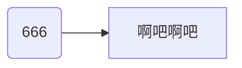

第一次访问本站的朋友们一定要来这里看看！这里是本站的 <big>食用</big> 指南！👍

## 一、基本使用方式

基本的啊，人人都要掌握！😁

### 1.1 本站简要说明

本站目前属于我个人的网站，后续会把各种内容整合，挑选出系统的、完善的和易于理解的，放到本站上来，如果你喜欢，还请记得给我这个项目，点个 Star！

> 什么？你问我怎么点 Star？网站右上角就是项目仓库链接哒，点进去就可以点了，再不会的就……

此网站是通过 GitHub Pages 的方式展示的，从域名也看得出来，底层是用 Python 的第三方库 MkDocs 建立的，美化的主题是 Material。
另外，所有文档的源文件都是用 Markdown 标记语言编写的！

这个网站啊，专门用于给各位随便看看用的，也算是我的个人笔记，你要是觉得不错，可以 Fork 本项目，留一份属于自己的！

> 什么？你问我怎么 Fork 本项目？我……你自己百度去 😂

关于本站名称：啊，一时兴起，随便取的 😅

### 1.2 界面介绍

#### 1.2.1 搜索栏

啊，搜索栏呐，就是搜索内容用的，没啥好说的。啊对了，打开搜索栏有快捷键噢：<kbd>/</kbd>，或者 ++s++，又或者是 ++f++

#### 1.2.2 主题切换

只支持明/暗两套主题哈，还有一个是系统主题（根据你的系统主题选择），切换按钮就在搜索栏左边。

#### 1.2.3 目录

右侧是当前页面文章的目录，左侧是……呃……也是目录，可以认为是一个 <big>大</big> 目录！

那么，顶部的导航栏，你可以认为是 <big>大大</big> 目录 😅

#### 1.2.4 回到页面顶部

当你不是处在文章最顶部时，向上滚动一下，会在屏幕中上部出现一个按钮，点它就飞到顶上区了。

### 1.3 基本操作

#### 1.3.1 切换页面

划到文章底部哈，可以看到“上一页”和“下一页”这俩玩意儿。
嗯，你点一下就知道是干嘛的了。

另外！很重要的事情就是！实际上你不用手动去点那个按钮去切换页面，你可以通过快捷键 ++left++ 和 ++right++ 来便捷切换！

这个功能我写的（本来是没有的嘞）。

此外，++p++ 和 ++n++ 也可以快捷地切换到上一页（Prev）和下一页（Next）。

!!! warning "我警告你噢"

    别发疯似的按快捷键，页面是要时间去加载的，崩了可别怪我哦！

#### 1.3.2 文章数据

文章最顶上是标题，然后是使用 statistic 插件实现的数据统计功能，会给出本篇文章的相关数据，并估计文章大致的阅读时间（虽然有可能非常不准确 😅）

文章最底下有这篇文章的提交信息，如创建时间，最后更改时间以及文章贡献者。。

#### 1.3.3 评论区

文章底部有个评论区！此功能由 giscus 提供，需要登录 GitHub 账号才能评论，因为这个评论实际上的 GitHub 仓库的讨论区，你在这里的评论同步到那里。

不过，只有部分页面我开了评论区，有些地方不适合评论。

#### 1.3.4 图片放大

有时候文章中的图片可能有点小，这个时候点击它就可以放大它哩！

## 二、高级使用姿势

了解了解总是没坏处撒！🤡

### 2.1 提示

#### 2.1.1 提示框

什么是提示框？比如上面那个警告就是，有些提示框可以折叠和展开，有些则不行，区别在于其右侧是否有个小的尖括号。你试试就知道了。

??? note "提示框"

    这是一个暗藏玄🐔的提示框！

#### 2.1.2 小提示

小提示不像那种大的提示框，大的提示框太占位置了，如果只是一个很小的提示，那么“杀鸡焉用宰牛刀”？

像这种就是小提示：(1)
{ .annotate }

1. 啊哈哈哈（“鸡汤来喽”音）……我是一个小提示！

你点击它才能查看相应的内容。

#### 2.1.3 小小提示

没想到吧！还有个 <small>小小</small> 提示！

啥是“小小提示”呢？呐~就是这个啦：:material-information-outline:{ title="我似一个小小提示" }

鼠标移上去时它才会显现。当然，它并不一定是一个图标，也可也是一个词语，一个字。

### 2.2 其它的一些

#### 2.2.1 流程图等

流程图并非图片，而是在 Markdown 中编写 mermaid 语法的代码实现。给个示例吧：



这里有一个详细点的：[点我传送](./Algorithm/sort/straight_insertion_sort.md#12-流程图)

顺便一提，这个颜色会随着主题变哟！

#### 2.2.2 任务列表

本质就是列表，只不过我对其作了特殊处理，使得它可以有切换的效果：

-   [ ] 还有一件事未完成，还有一件事，还有一……
-   [x] 我滴任务完成啦！

你可以通过点击图标来切换它们的状态，但是要注意：此状态并不会被记录，一旦你刷新浏览器，就没了。

## 三、关于代码

怎么可能不涉及代码呢？

### 3.1 代码高亮

代码高亮有两种，一般高亮行内代码，语法高亮行内代码，代码块高亮。

#### 3.1.1 一般高亮行内代码

就这个：`range()`、`print` 等，是莫得颜色的冷酷代码。

#### 3.1.2 语法高亮行内代码

是这个啦：`#!python range(666)`，炫酷的行内代码！

#### 3.1.3 代码块高亮

很常见：

```cpp
#include <iostream>

int main(){
    std::cout << "Fucking Code!" << std::endl;
    return 0;
}
```

上述代码仅做演示，无不良向导 😅

从上面你也可以看到，代码块右上角有个图标，点击可以复制代码啦！然后那个行号也是可以点击的，锚定到某一行代码。

### 3.2 多重代码块

这里有个多重代码块的示例，源地址在这里：[点我飞过去](./Algorithm/sort/straight_insertion_sort.md#21-多语言版本)

=== "🟣 C 17"

    ```c
    --8<-- "sources/Algorithm/sort/C/straight_insertion_sort.c"
    ```

    1. 相等时，被比较元素原来在前面的就不用右移了，保证稳定性

=== "🔴 C++ 20"

    ```cpp
    --8<-- "sources/Algorithm/sort/C++/straight_insertion_sort.cpp"
    ```

    1. 相等时，被比较元素原来在前面的就不用右移了，保证稳定性

=== "🔵 Python 3"

    ```python
    --8<-- "sources/Algorithm/sort/Python/straight_insertion_sort.py"
    ```

    1. 相等时，不确定位置的元素的位置也能确定了，一定在当前被比较元素的右边

=== "🟠 Java 21"

    ```java
    --8<-- "sources/Algorithm/sort/Java/straight_insertion_sort.java"
    ```

    1. 相等时，被比较元素原来在前面的就不用右移了，保证稳定性

=== "🟢 C# 12"

    ```csharp
    --8<-- "sources/Algorithm/sort/C#/straight_insertion_sort.cs"
    ```

    1. 相等时，被比较元素原来在前面的就不用右移了，保证稳定性

=== "🟡 TypeScript 5"

    ```typescript
    --8<-- "sources/Algorithm/sort/TypeScript/straight_insertion_sort.ts"
    ```

    1. 相等时，被比较元素原来在前面的就不用右移了，保证稳定性

通过点击不同的标签可以切换代码块，常用于多语言演示。

### 3.3 代码可视化

这个功能啊，由 PythonTutor 提供的，我实际也不知道他们咋弄出来的，反正直接用个 `#!html <iframe>` 标签给它包起，扔到对应位置就行了。

下面给个示例哈：

--8<-- "pythontutor/Algorithm/sort/Python/straight_insertion_sort.md"

我顺便给它包装了一下，加了个提示框，并在提示框标题右侧位置加了图标按钮（:material-open-in-new:），点击就可以传送到源网址，大屏看可视化代码哩！
只可惜我能力有限，无法给它适配明暗主题喽……（悲）

---

差不多就这些了，哦对了，还有呢！此网址几乎支持所有 Markdown 操作，包括你想得到的和想不到的！

说了这么多，不知道你吃饱没？（因为这是“食用”指南啊！）留下你的足迹吧（把足迹放下面的评论区里）
