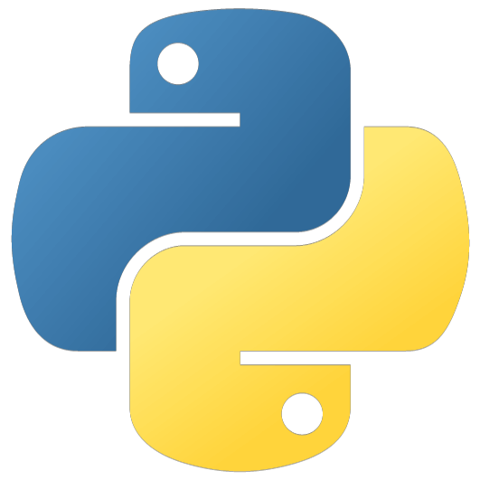

## 一、Python 简介

<div align="center">

<br/>
<small>Python Logo</small>
</div>

### 1.1 什么是 Python

Python 是一门大小写敏感的、动态类型的、解释型的编程语言。

#### 1.1.1 大小写敏感

将大写英文字母和对应的小写英文字母视为不同的标识符，反之则视为相同的。

例如，`Python`  和 `python` 就是两个不同的标识符。

#### 1.1.2 动态类型

Python 变量与其存储的值是分开的，没有必然的联系，因此 Python 变量的类型也就是动态的，因为其关联的数据的类型就是动态的。在我看来，这是一个非常好的特性。

#### 1.1.3 解释型

Python 程序的运行一般需要依靠 Python 解释器对其进行解释，而不像 C 和 C++ 那样的编译型语言，编译完成后可以直接在对应平台上运行。这个特性给予了 Python 一些优点和缺点，优点是 Python 程序可以非常方便的进行修改和编辑然后马上重新解释运行，大大地加快了开发的速度，但缺点是 Python 程序的运行必须依靠 Python 解释器的存在。若对应的机器上没有 Python 环境，那么 Python 程序大概率无法直接运行。

### 1.2 Python 为什么叫 “Python”

#### 1.2.1 Python 名称的由来

Python 名称来源于 Python 创始人 _Guido van Rossum_ 对 _Monty Python_ 喜剧团体的喜爱。1989 年他开始编写 Python 解释器时，他需要一个简单，独特且有趣的名称，以便为其编写文档时引起人们的兴趣。因此，他选择了 Python 这个名称，并将其与 _Monty Python_ 这个喜剧团体联系起来，以表达他的幽默感。

#### 1.2.2 Guido van Rossum

<div align="center">

<br/>
<small >Guido van Rossum</small>
</div>

_Guido van Rossum_ 是一名荷兰计算机科学家，被誉为是 Python 编程语言的创始人（实际创始人也是他），根据名字的发音(1)，国内常简称他为“龟叔”。他于 1982 年在荷兰莱顿大学获得了计算机科学学士学位，之后在荷兰国家数学与计算机科学研究所从事了 8 年的研究工作。在 1990 年代初，他开始开发 Python 编程语言，并于 1991 年公开发布了第一个 Python 版本。他在 Python 社区中担任着重要的领导角色，带领着该社区不断地发展壮大。他也曾在 Google 工作，担任技术研究员和软件工程师，并在 Google 期间继续对 Python 的开发和推广做出了重要贡献。
{ .annotate }

1. 尽管实际发音与“龟叔”这一昵称相差得有些远 😅

#### 1.2.3 Python 的口号

在国内，Python 的口号是 “人生苦短，我用 Python”。_Bruce Eckel_ 原话是 “Life is short, you need Python"，但 “我用 Python” 是 _Guido van Rossum_ 穿的 T 恤上印的话（见下图）。

<div align="center">

<br/>
<small>右上三是 “龟叔”</small>
</div>

这句口号简短地表明了 Python 最主要的特征，就是简单！人生并不是很长，如果你选择把时间花费在复杂冗长的语法上，而不是有用的逻辑上，岂不是十分的不值得？

这里我们可以与主流语言 Java 做对比，两者都是流行语言，但完成同样一件事情所需的代码量差异非常之大（毕竟 Java 语法的冗长比较明显）。下面是两段完成同一件事情所需的代码：

```java title="🟠 Java"
@FunctionalInterface
interface Formula {
    double calculate(double x);
}

public class Test {
    public static void main(String[] args) {
        Formula f = x -> 3 * x * x + 2 * x + 1;
        double result = f.calculate(2.5);
        System.out.println(result);
    }
}
```

```python title="🔵 Python"
f = lambda x: 3 * x**2 + 2 * x + 1

result = f(2.5)
print(result)
```

这里不是批评 Java 不好，这里只是做一个简单的对比，别无它意，仅此而已。

### 1.3 为什么选择 Python

#### 1.3.1 Python 简单易学

Python 是一门对新手非常友好的编程语言，因为它语法简单，语义明确，能让我们用最接近自然语言的方式来编写程序，但你想学精也是有难度的（虽没有 C++ 那样难）。

#### 1.3.2 Python 资料众多

Python 的学习资料非常多，包括此教程，也是 Python 学习资料之一。实际上，Python 官方也有教程和文档，甚至，官方还给出了中文版的（虽然不是 100% 完全翻译的）！

官方中文版文档链接（强烈建议多看几遍文档）：[Python Documentation](https://docs.python.org/zh-cn/3/)

!!! question "猜你想问：既然有那么多教学资料，那为什么选择这个教程呢？"

    首先，这篇教程属于基于我个人理解编写而成的，我会从初学者的角度来进行讲述，但同时兼具深度和难度（保证和其他教程有很大不同）。此外，我会及时对文章的评论做出回答，及时形成反馈。

#### 1.3.3 Python 流行广泛

Python 主要方向有网络开发、网络爬虫、人工智能、大数据、科学计算等。但这些是 Python 比较流行的方向，并不代表 Python 在其他方面不够优秀。比如图形化编程，一直被认为不是 Python 合适的方向，但现在也在逐渐改变，尤其是两大 Qt 第三方库（PyQT 和 PySide）的引入，极大地提高了 Python 在 GUI 编程领域的水平。

Pythoon 的宗旨是简单明确且优雅，什么事情能够快速且准确地实现，速度或许会相对于其它编程语言要慢一些，但它开发速度快，出错的概率低，这不正是编写程序的一大目标吗？就算它比较慢，但 Python 官方近些年来一直尝试加快 Python 的运行速度（典型的就是 Python 3.11 版本更新极大地加快了运行速度，见下图）

<div align="center">

<br/>
<small>Python 3.11 更新说明的宣传 Logo</small>
</div>

在我看来，Python 若是运行速度能与主流编译型语言靠齐，那便是最好的编程语言，没有之一了。Python 社区也十分地活跃，每天都有很多的内容在产出。

Python 历年流行趋势图：[TIOBE Index - TIOBE](https://www.tiobe.com/tiobe-index/python/)

#### 1.3.4 Python 开源免费

这虽然不是一个重要的因素，但还是必须要提一下，免费开源的总是更加安全一些，更容易获得信任。

## 二、Python 的发展历史

### 2.1 开发之前

Python 编程语言实际有一个“前置”语言作为启发，那就是 ABC 语言。

!!! info "扩展知识：ABC 语言"

    ABC 语言是在 NWO（荷兰科学研究组织）旗下 CWI（荷兰国家数学与计算机科学研究中心）的 _Leo Grurts_，_Lambert Meertens_，_Steven Pemberton_ 主导研发一种交互式，结构化高级语言，旨在替代 BASIC，Pascal 等语言，用于教学及原型软件设计。Python 创始人 _Guido van Rossum_ 于20 世纪 80 年代曾在 ABC 系统开发中工作了数年。
    <p align="right">—— [ABC 语言 - 百度百科](https://baike.baidu.com/item/ABC%E8%AF%AD%E8%A8%80/334996)</p>

Python 有很多特点都是借鉴于 ABC 语言，或者说早期的 Python 就是 ABC 的改良版。  但 ABC 语言最后失败了，没有流行下去，就 _Guido_ 本人看来，ABC 失败的原因是高级语言为时过早，并且平台迁移能力弱，难以添加新功能，仅仅专注于编程初学者，没有把有经验的编程人员纳入其中，其通过 Python  解决了其一些问题，让拓展模块的编写非常容易，并且可以在多平台进行运行。

### 2.2 开发早期（1989-1991）

在 1989 年圣诞节期间的阿姆斯特丹，_Guido_ 为了打发圣诞节的无趣，决心开发一个新的脚本解释语言，作为 ABC 语言的一种继承，两年后的 1991 年，发布了第一个公开发行版。此时都是由 _Guido_ 进行开发和管理的。

### 2.3 Python 1 时期（1991-2000）

初始阶段，Python 1 时期主要实现了基本的语法结构、数据类型、异常处理、模块系统等特性。Python 1.0 于 1994 年发布，引入了 lambda 表达式、map、filter 和 reduce 等函数式编程工具。Python 1.6 于 2000 年发布，是 Python 1.x 系列的最后一个版本。

### 2.4 Python 2 时期（2000-2020）

发展阶段，主要增加了许多新功能和改进，如 Unicode 支持、列表推导、垃圾回收机制、生成器、装饰器、迭代器协议、新式类等。Python 2.0 于 2000 年发布，引入了循环引用检测垃圾回收机制和全局解释器锁（GIL）。Python 2.4 于 2004 年发布，同年 Django 框架诞生。Python 2.7 于 2010 年发布，是 Python 2.x 系列的最后一个版本。Python 2.7 原定于 2015 年结束支持，后延长至 2020 年，并确认不会有 2.8 版本发布。

### 2.5 Python 3 时期（2008- 现在）

成熟阶段，主要进行了一些重大的改变和优化，如移除旧式特性、统一文本和二进制数据模型、增加类型注解、异步编程支持等。Python 3.0 于 2008 年发布，不完全兼容 Python 2.x，并提供了 2to3  工具来帮助迁移代码。Python 3.6 于 2016 年发布，引入了格式化字符串字面量（f-string）等新特性。Python 3.9 于 2020 年发布，移除了 distutils 包等已弃用的 API。截至 2024 年 3 月，Python 3.12 是最新稳定版本。

下面是截至 2024 年 3 月，[Python 的发布周期](https://devguide.python.org/versions/)：

<div align="center">

<br/>
<small>Python 发布周期</small>
</div>

---

参考资料：

1. [Python 的发展简史](https://zhuanlan.zhihu.com/p/659988096)
2. [Python 早期设计与开发：从 ABC 到 Python](https://zhuanlan.zhihu.com/p/60077260)
